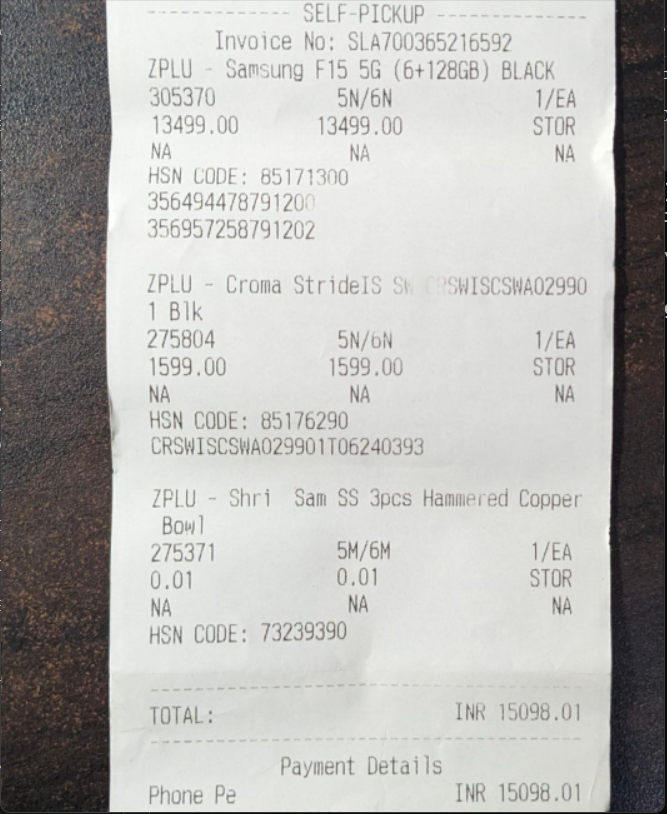

# 📄 **Document Scanner**  
A small-scale, GUI-based **Document Scanner** built with **Python** and **OpenCV** that transforms photos of documents into clean, high-contrast scanned images — just like a mobile scanner app!  

This tool uses **automatic contour detection** and allows **manual corner correction** via a user-friendly interface, making it super handy for uneven images or poor edge detection.

---

## 🚀 Features

✅ Select an image using a file dialog  
✅ Automatically detect the document's edges  
✅ Manually edit the corners by dragging points  
✅ Apply perspective transformation to get a top-down view  
✅ Convert the result into a **clean, black & white scanned image**

---

## 🖼️ How It Works

1. 📂 **Load an image** from your file system using a GUI file picker.  
2. ✂️ **Detect edges** and find document contours using OpenCV.  
3. 🎯 **Edit contours manually** if needed, using intuitive drag-and-drop controls.  
4. 🌀 **Apply perspective warp** to get a flat, top-down view.  
5. 🧽 **Threshold the image** to achieve a neat, scan-like finish.

---

## 🔧 Technologies Used

- **OpenCV** – for image processing and computer vision  
- **imutils** – for easy image transformations  
- **skimage** – for adaptive thresholding  
- **NumPy** – for numerical operations  
- **Tkinter** – for file selection GUI

---

## 🖱️ Manual Editing Controls

| Action             | Key/Mouse             |
|--------------------|-----------------------|
| Move a point       | 🖱️ Click & drag       |
| Save and scan      | `s`                   |
| Cancel editing     | `Esc`                 |

---

## 📸 Before & After

| Original Image                  | Scanned Output                  |
|-------------------------------|----------------------------------|
|  |  |

> *(Add your screenshots to show how cool your scanner works!)*

---

## 📁 Getting Started

Clone the repo and run:

```bash
pip install opencv-python imutils scikit-image numpy
python scanner.py
```

---

Let me know if you want a **fancy badge section**, **setup instructions**, or a **GIF demo** too!
